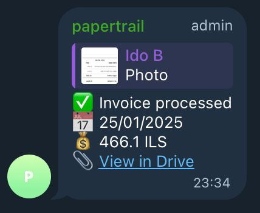

<p align="center">
  
</p>

<h1 align="center">Papertrail Invoice Bot</h1>

<p align="center">
  A serverless Telegram bot that automatically processes invoice images<br>
  using AI vision, stores them in Cloud Storage, and logs data to Google Sheets.
</p>

<p align="center">
  <a href="https://github.com/idobetesh/papertrail/actions/workflows/ci.yml"></a>
  <a href="https://github.com/idobetesh/papertrail/actions/workflows/deploy.yml"></a>
  <br>
  
  
</p>

## Features

- 📸 **Photo Processing** - Send invoice photos to Telegram group
- 🤖 **AI Vision** - Gemini/GPT-4o extracts invoice data (Hebrew + English)
- ☁️ **Cloud Storage** - Auto-organized by `YYYY/MM/`
- 📊 **Sheets Logging** - All extracted data logged automatically
- 🔄 **Reliable** - Cloud Tasks with retry & deduplication
- 💰 **Cost-effective** - Scales to zero, mostly free tier

## Architecture

```
Telegram → Webhook Handler (Cloud Run) → Cloud Tasks → Worker (Cloud Run)
                                                            ↓
                                              Cloud Storage + Sheets + Firestore
```

## Quick Start

```bash
# Install
make install

# Configure
cp infra/terraform/terraform.tfvars.example infra/terraform/terraform.tfvars
# Edit with your values

# Deploy
make terraform-init terraform-apply push
```

## Requirements

- Node.js 24+
- Docker
- Terraform 1.0+
- GCP account with billing
- Telegram Bot Token
- OpenAI API Key (fallback) and/or Gemini API Key

## Commands

```bash
make install          # Install dependencies
make dev-webhook      # Run webhook locally
make dev-worker       # Run worker locally
make test             # Run tests
make lint             # Lint code
make push             # Build & push images
make terraform-apply  # Deploy infrastructure
make version          # Check deployed version
make rollback-webhook # Rollback to previous version
```

## Configuration

Set these in `terraform.tfvars`:

| Variable | Description |
|----------|-------------|
| `project_id` | GCP project ID |
| `telegram_bot_token` | Bot token from @BotFather |
| `webhook_secret_path` | Random secret for webhook URL |
| `openai_api_key` | OpenAI API key (fallback) |
| `gemini_api_key` | Gemini API key (primary, free tier) |
| `sheet_id` | Google Sheet ID |

---

<p align="center">
  
  <br>
  <em>Example: Success message after processing an invoice</em>
</p>
